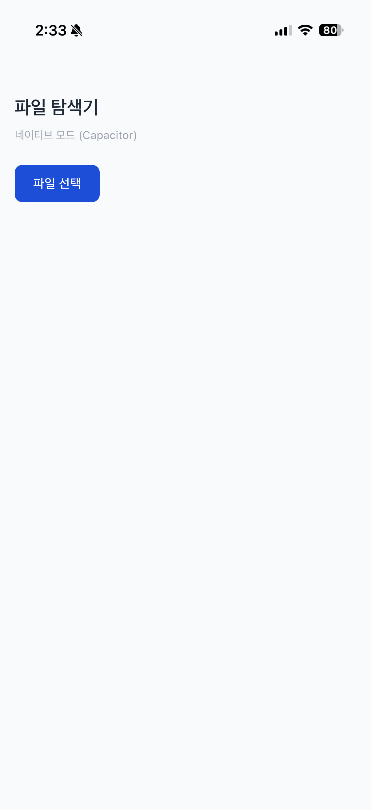
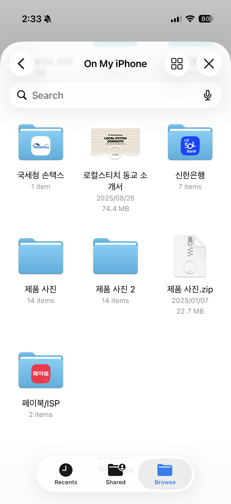
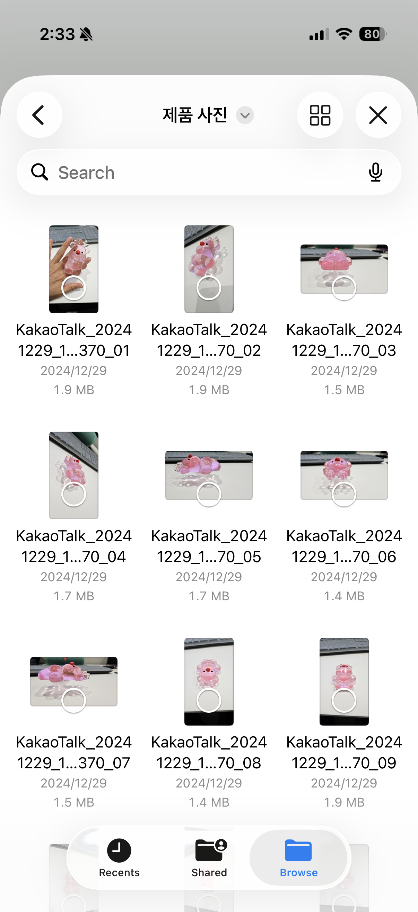
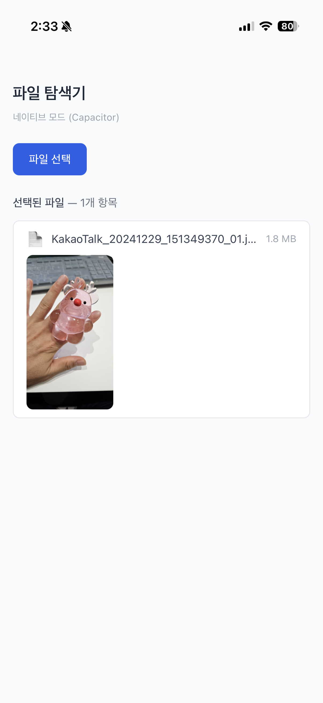
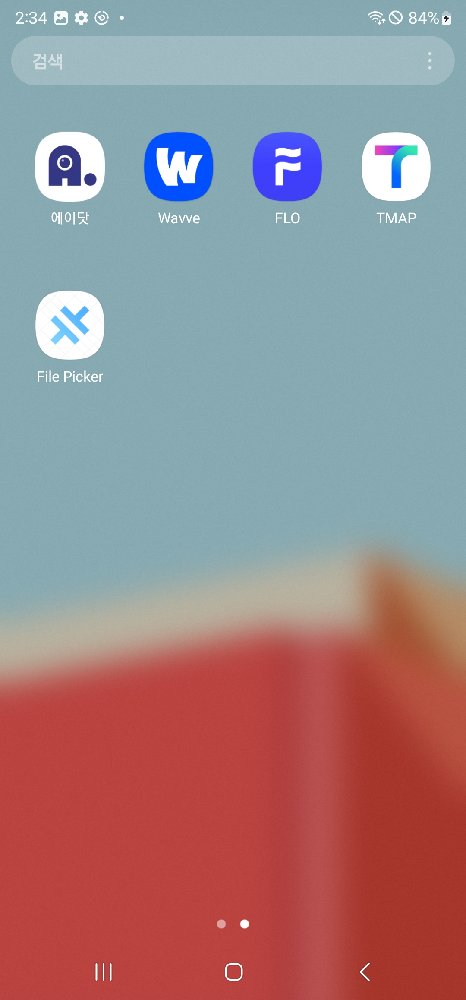
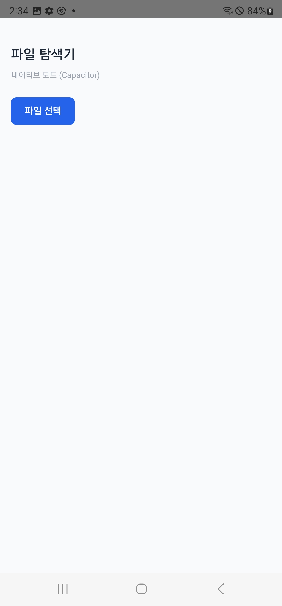
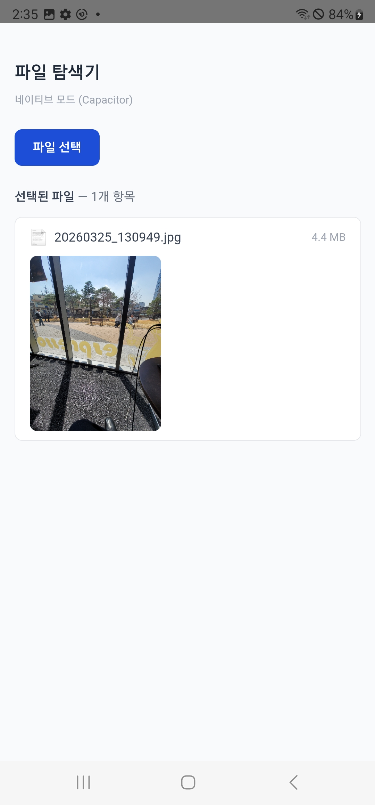

# file-selection-spike

Capacitor 기반 파일 선택 + 이미지 프리뷰 스파이크. 단일 HTML(React CDN)로 iOS/Android 네이티브 앱을 빌드한다.

## 스택

- React 18 (CDN) + Tailwind CSS
- Capacitor 8
- @capawesome/capacitor-file-picker

## 동작

- 네이티브(iOS/Android): `@capawesome/capacitor-file-picker`로 파일 선택, base64 데이터로 이미지 프리뷰
- 웹: `showDirectoryPicker` API 또는 `<input webkitdirectory>` 폴백

## 실행

```bash
npm install

# 웹
npx serve www

# iOS
npx cap sync ios
npx cap open ios    # Xcode에서 빌드

# Android
npx cap sync android
npx cap open android  # Android Studio에서 빌드
```

## 스크린샷

### iOS

| 메인 화면 | 파일 브라우저 | 파일 목록 |
|:-:|:-:|:-:|
|  |  |  |

| 이미지 프리뷰 | 롱프레스 메뉴 |
|:-:|:-:|
|  |  |

### Android

| 홈 앱 아이콘 | 메인 화면 | 파일 브라우저 | 이미지 프리뷰 |
|:-:|:-:|:-:|:-:|
|  |  |  |  |
