# Todo App 02 - Realtime

Supabase Realtime 기반 Todo 앱. React (CDN) + Supabase JS로 구현된 정적 사이트.

## Production

https://todoapp05realtime.vercel.app

## Features

- 이메일/비밀번호 인증 (Supabase Auth)
- Todo CRUD with Realtime sync (postgres_changes)
- 다른 탭/기기의 변경사항 실시간 반영 (flash animation)
- Optimistic UI + Realtime 중복 방지
- Tailwind CSS 스타일링

## todo_app_02 vs todo_app_02_realtime 비교

### 통신 방식 차이

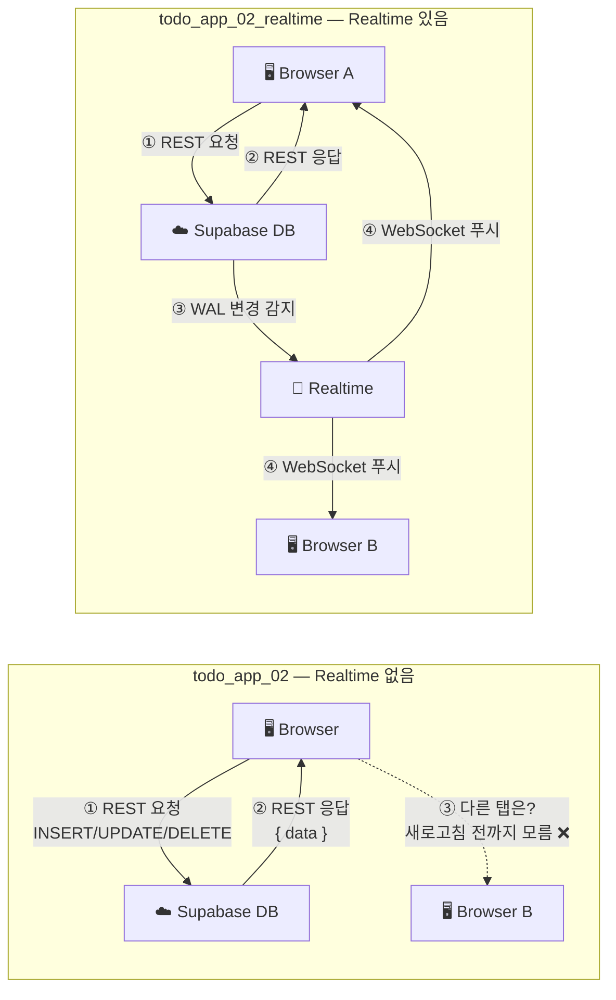

### 데이터 흐름 비교

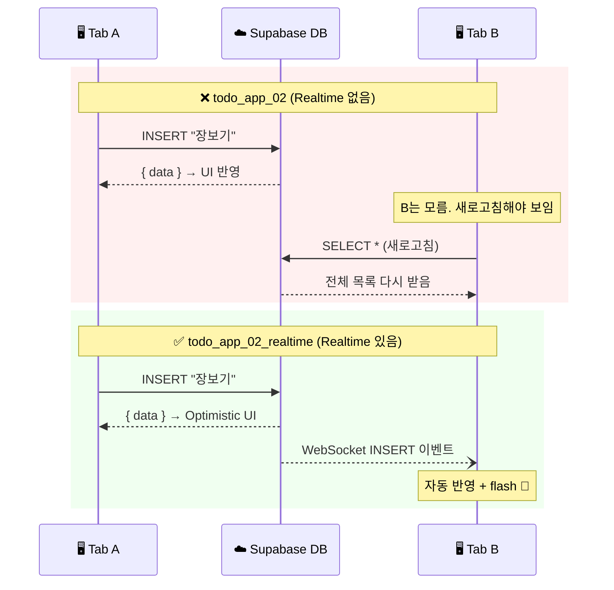

### 코드 차이 요약

| 항목 | `todo_app_02` | `todo_app_02_realtime` |
|------|--------------|----------------------|
| **프로토콜** | REST API만 사용 | REST API + WebSocket |
| **데이터 동기화** | 페이지 로드 시 1회 fetch | 로드 시 fetch + 실시간 구독 |
| **다른 탭 반영** | 새로고침 필요 | 자동 반영 (INSERT/UPDATE/DELETE) |
| **연결 상태 표시** | 없음 | Live 인디케이터 (초록 dot) |
| **원격 변경 피드백** | 없음 | flash 애니메이션 (파란색) |
| **중복 방지 로직** | 없음 (불필요) | `localActionIds` ref로 본인 이벤트 무시 |
| **에러 복구** | API 실패 시 `fetchTodos()` 재호출 | Realtime이 자동으로 최신 상태 유지 |
| **DB 설정** | 테이블 + RLS | 테이블 + RLS + `ALTER PUBLICATION` |
| **추가 컴포넌트** | 없음 | `RealtimeStatus` |
| **추가 CSS** | `slideIn` 1개 | `slideIn` + `flash` + `pulse` 3개 |

### 추가된 코드 (핵심 부분만)

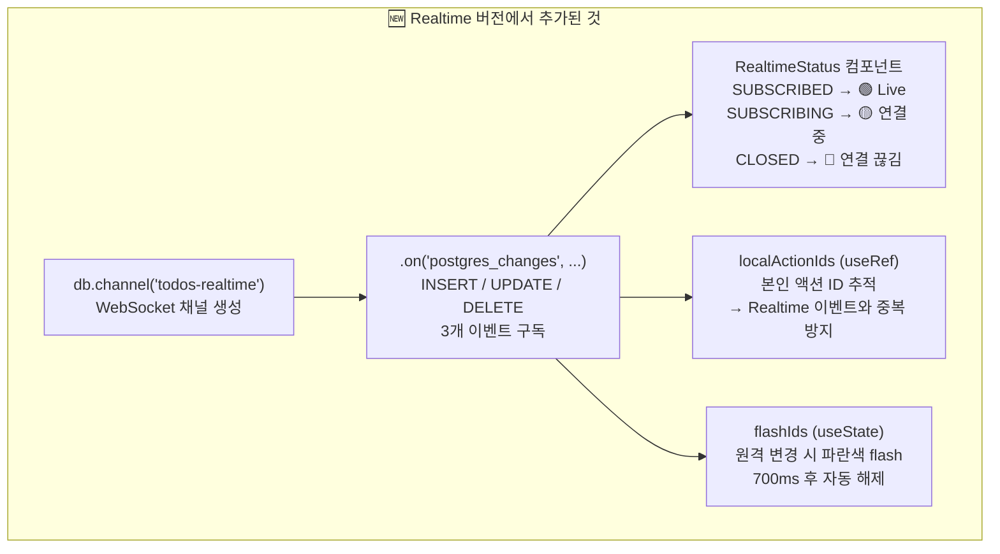

---

## Architecture

### 전체 구조

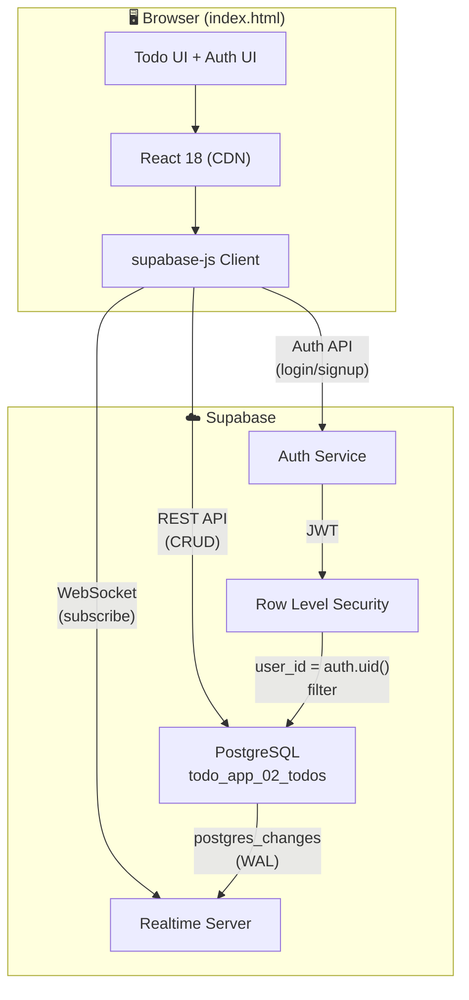

### Realtime 동작 흐름

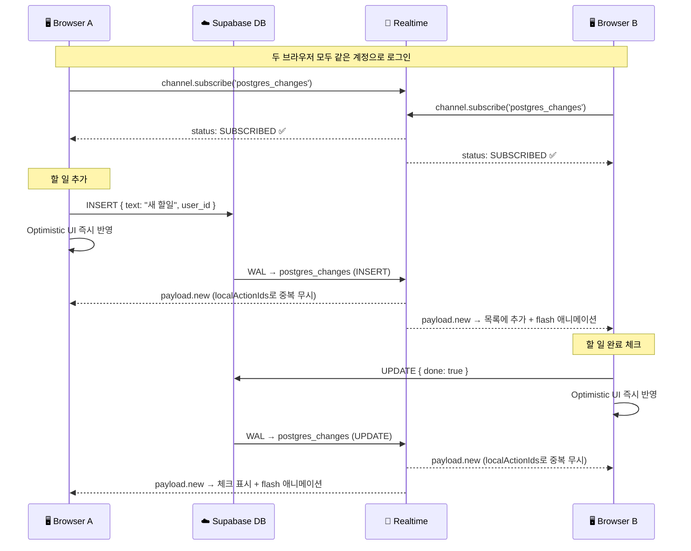

### RLS + Realtime 보안

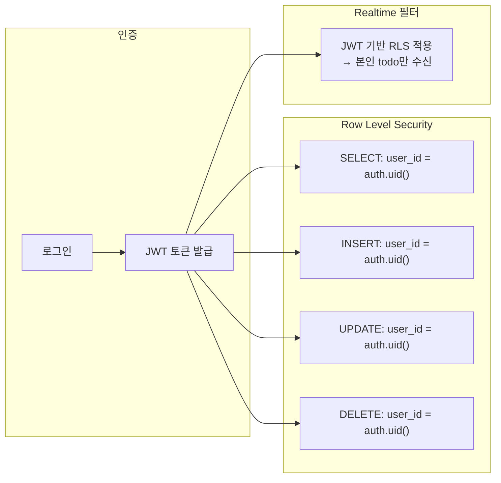

### Optimistic UI + Realtime 중복 방지

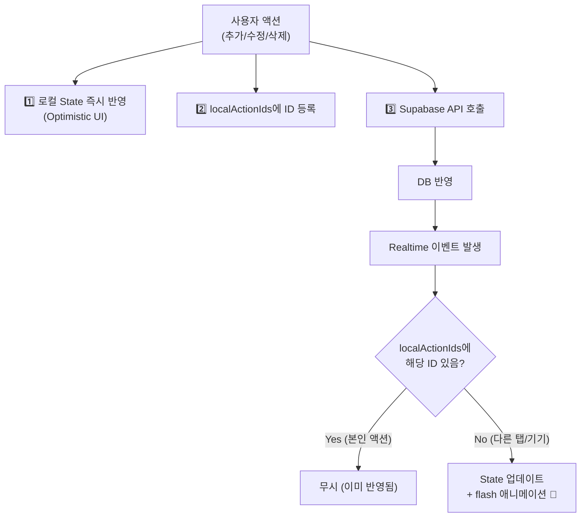

## DB Setup

`setup_db.js`로 Supabase 테이블 생성 + RLS 정책 + Realtime 활성화를 할 수 있습니다.

```bash
npm install pg
node setup_db.js
```

주요 SQL:
```sql
-- Realtime 활성화
ALTER PUBLICATION supabase_realtime ADD TABLE todo_app_02_todos;
```

## Screenshots

| 로그인 | 빈 목록 (Live) | 할 일 추가 |
|--------|---------------|-----------|
|  | 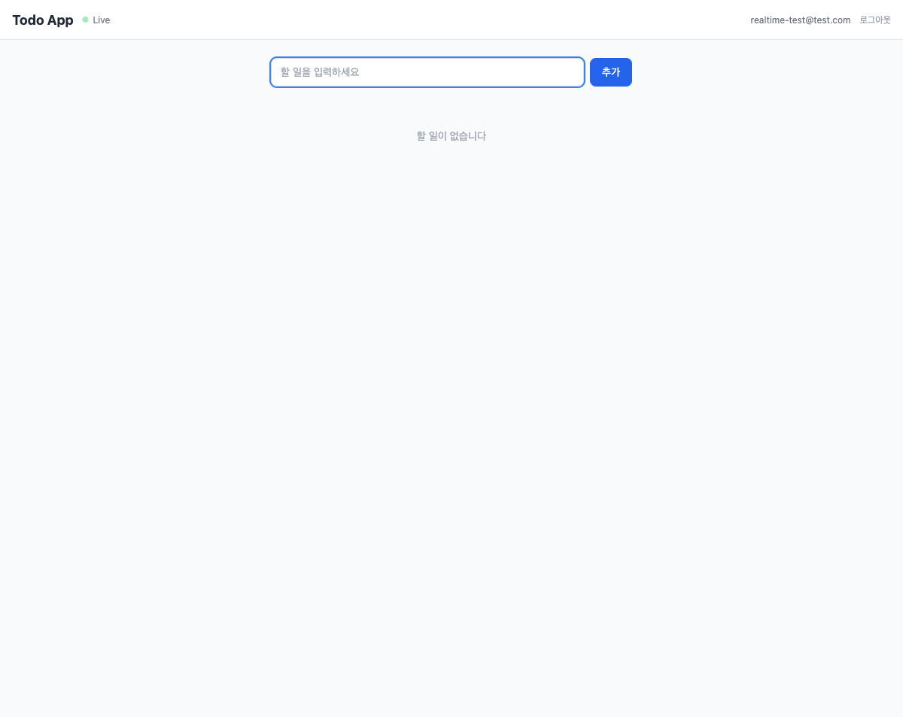 | 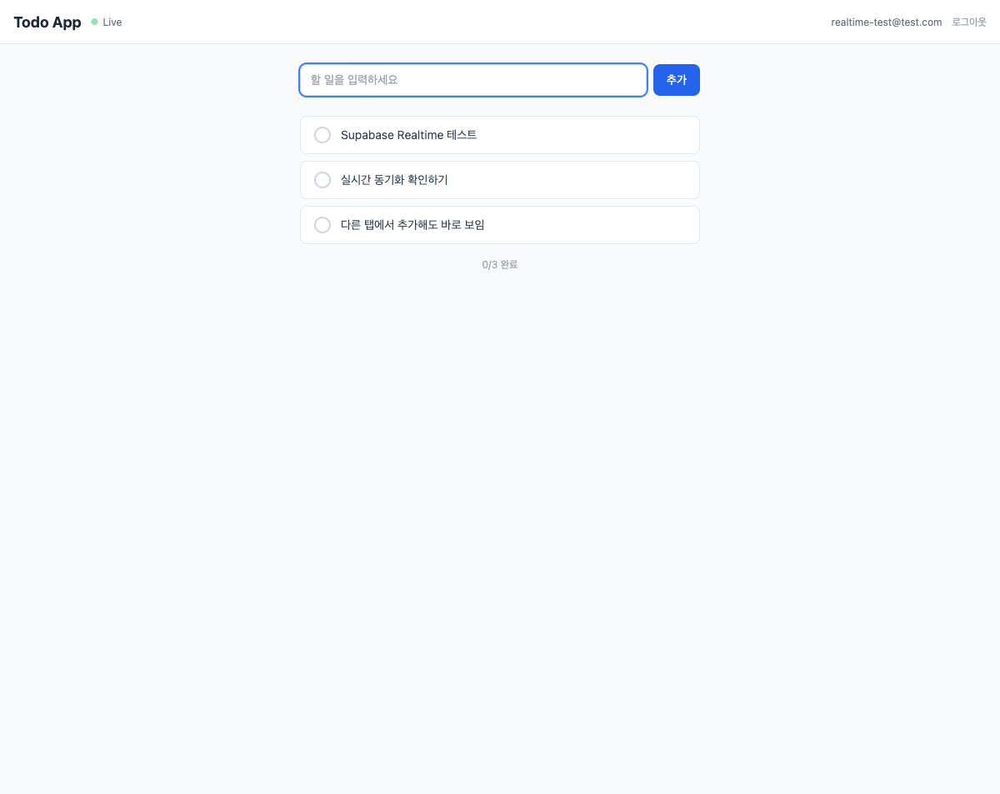 |

| 완료 체크 | 삭제 후 | 로그아웃 |
|----------|--------|---------|
| 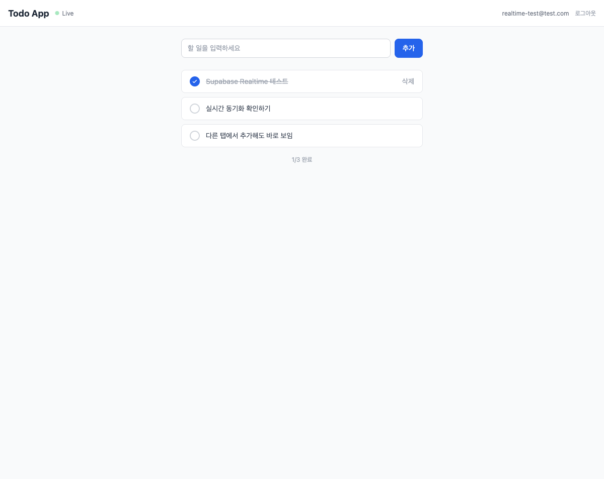 | 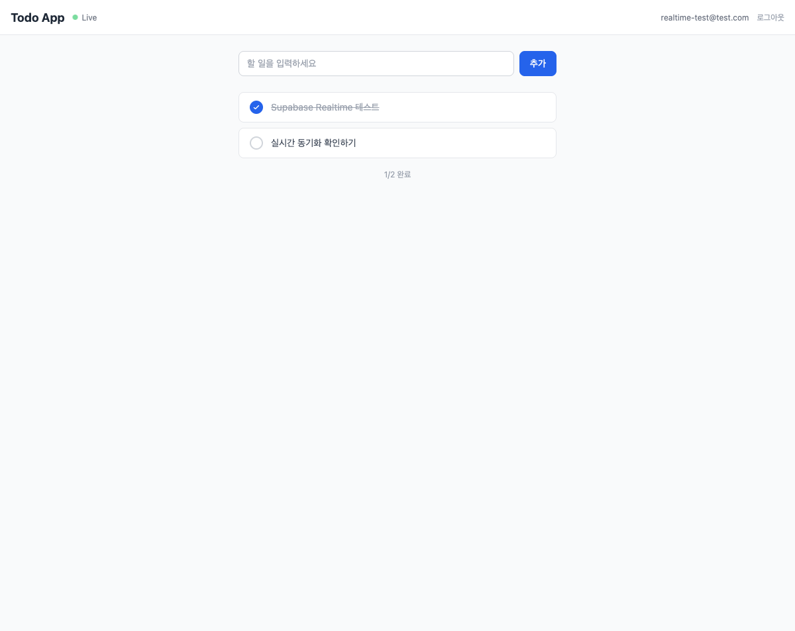 | 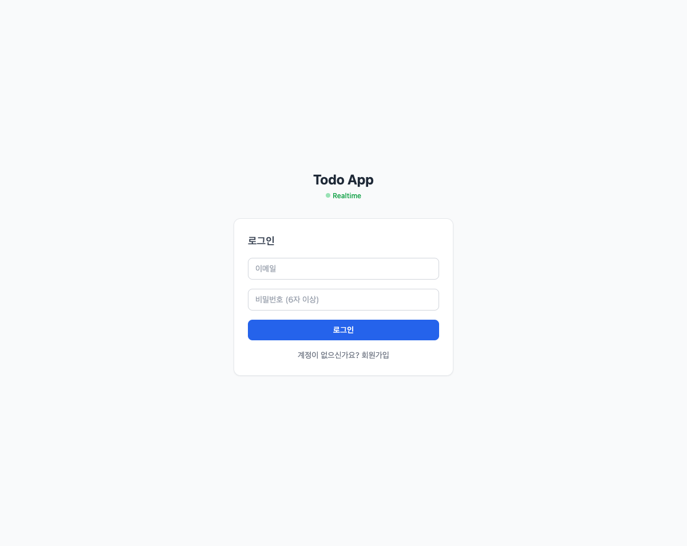 |
